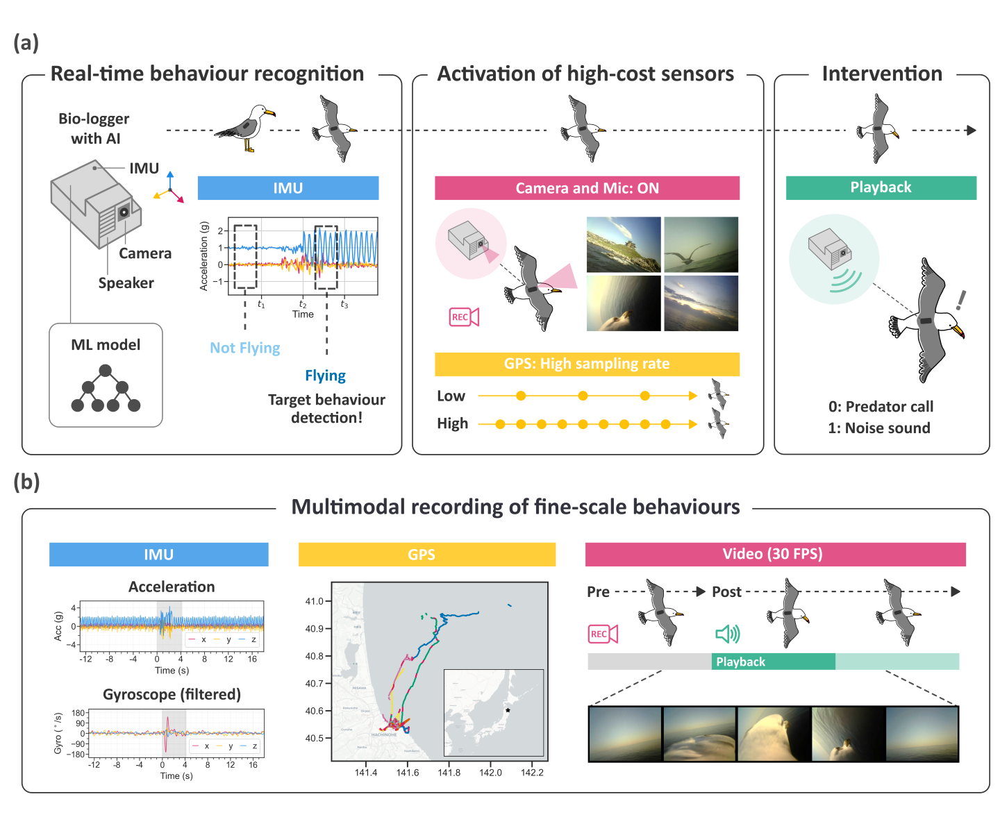
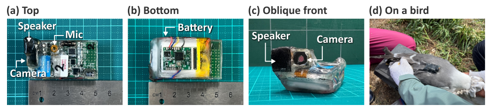
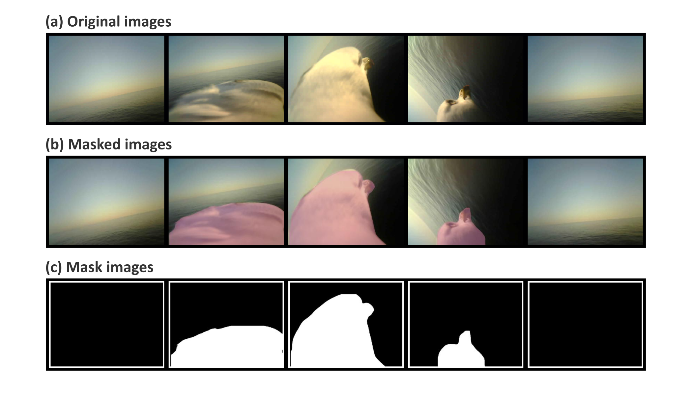

# logbot-playback-2024

This is a repository for the paper titled "Real-time behaviour recognition on bio-loggers enables autonomous audio playback experiments in free-ranging seabirds".  


<p><strong>Figure 1 (from the paper):</strong> Conceptual overview of autonomous audio playback experiment system using bio-loggers attached to seabirds.</p>

<!-- 
<p><strong>Figure 1 (from the paper):</strong> Conceptual overview of autonomous audio playback experiment system using bio-loggers attached to seabirds.</p> -->

<!-- 
**Figure 1 (from the paper): Conceptual overview of autonomous audio playback experiment system using bio-loggers attached to seabirds.** -->

## Author
Author Name
[Website](https://author) | [GitHub](https://github.com/author) | [Google Scholar](URL) | [Researchmap](URL) 

## Paper
> Otsuka et al., (2025) "Real-time behaviour recognition on bio-loggers enables autonomous audio playback experiments in free-ranging seabirds." *Journal Name (TBA)*. 

published paper: [URL (TBA)]()

## Overview
The repository includes 3 directories below.
```bash
- arduino/ (-> Arduino program of the bio-logger)
- umineko-analysis/ (-> data analysis) 
- umineko-segment/ (-> image segmentation)
```

1. [arduino/]() directory contains source code of the bio-logger program used in the field experiment.
2. [umineko-analysis/]() directory contains source code for data pre-processing, data visualization, Bayesian statistical modelling, and CausalImpact analysis.
3. [umineko-segment/]() directory contains source code for training and testing an image segmentation model.

## arduino
Arduino program: [arduino/logbot-v5-playback/](arduino/logbot-v5-playback/)

The audio playback system on the bio-loggers was programmed in Arduino and C++. The logger program was compiled using Arduino IDE version 2.3.2.  
  


<p><strong>Figure 2 (from the paper):</strong> Photos of our AI playback bio-logger (waterproofed).</p>

<!-- 
<p><strong>Figure 2 (from the paper):</strong> Photos of our AI playback bio-logger (waterproofed).</p> -->

<!--   
**Figure 2 (from the paper): Photos of our AI playback bio-logger (waterproofed).** -->

## umineko-analyis
[umineko-analysis](umineko-analysis/)

| What                           | Language    |
| :----------------------------- | :---------- |
| Data pre-processing            | Python      |
| Data visualization             | Python, R   |
| Bayesian statistical modelling | R           |
| CausalImpact analysis          | R           |

See the following files to check Python libraries and R packages and their version.
- [umineko-analysis/requirements.txt](umineko-analysis/requirements.txt) for Python libraries
- [umineko-analysis/r-analysis/renv.lock](umineko-analysis/r-analysis/renv.lock) for R packages

### Data pre-processing and visualization using Python
```
umineko-analysis
  - data
  - notebooks
  - output
  - r-analysis
  - src 
```

To run data pre-processing of acceleration and GPS data, use the Jupyter notebooks below.
- [umineko-analysis/notebooks/00_check_raw_data.ipynb](umineko-analysis/notebooks/00_check_raw_data.ipynb)
- [umineko-analysis/notebooks/01_extract_session_data.ipynb](umineko-analysis/notebooks/01_extract_session_data.ipynb)

### Modelling and visualization using R
[umineko-analyis/r-analysis](umineko-analysis/umineko-analysis/)
```
r-analysis
  - data
  - docs
  - models
  - notebooks
  - output
  - src
```

To run Bayesian statistical models, use the R file below.  
[umineko-analysis/r-analysis/run_lmm.R](umineko-analysis/r-analysis/run_lmm.R)
```bash
run_lmm.R
```

To perform CausalImpact analysis, use the R file below.  
[umineko-analysis/r-analysis/run_causal_impact.R](umineko-analysis/r-analysis/run_causal_impact.R)
```bash
run_causal_impact.R
```

## umineko-segment


<p><strong>Figure S3 (from the paper):</strong> Example of image segmentation using the custom-trained model (detecting the head and neck of black-tailed gulls).</p>

<!-- 
<p><strong>Figure S3 (from the paper):</strong> Example of image segmentation using the custom-trained model (detecting the head and neck of black-tailed gulls).</p> -->

<!-- 
**Figure S3 (from the paper): Example of image segmentation using the custom-trained model (detecting the head and neck of black-tailed gulls).** -->
  
training: [umineko-segment/notebooks/yolov8-train.ipynb](umineko-segment/notebooks/yolov8-train.ipynb)   
prediction: [umineko-segment/notebooks/yolov8-predict.ipynb](umineko-segment/notebooks/yolov8-predict.ipynb)  
env: [umineko-segment/docker/](umineko-segment/docker/)

## Links
The code in this repository was written based on the following repositories.
- [Bayesian statistical modelling by MatsuuraKentaro (JP)](https://github.com/MatsuuraKentaro/RStanBook) | [(EN)](https://github.com/MatsuuraKentaro/Bayesian_Statistical_Modeling_with_Stan_R_and_Python)
- [CausalImpact by Google](https://github.com/google/CausalImpact)
- [YOLOv8 by ultratics](URL)